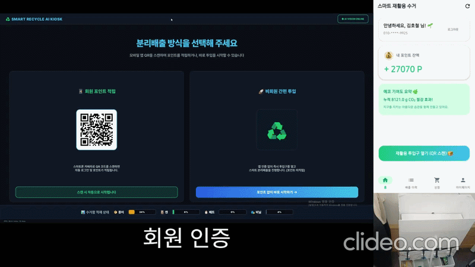
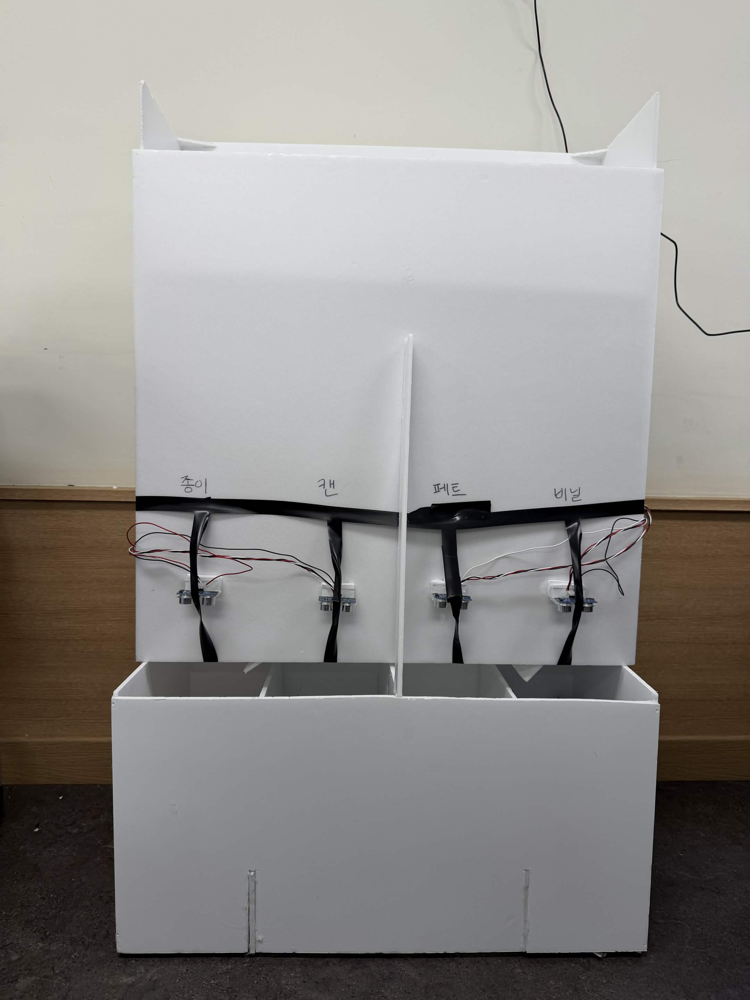
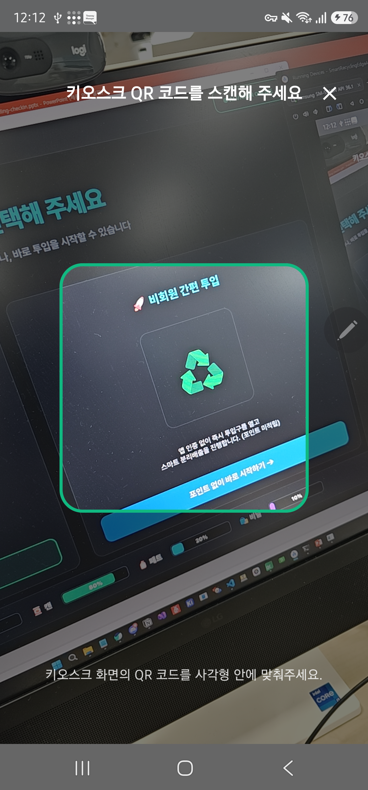
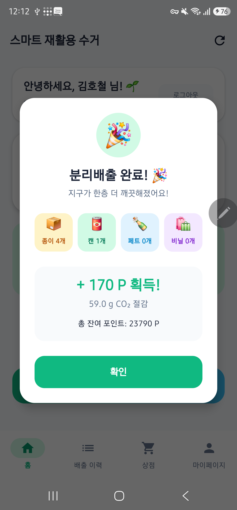
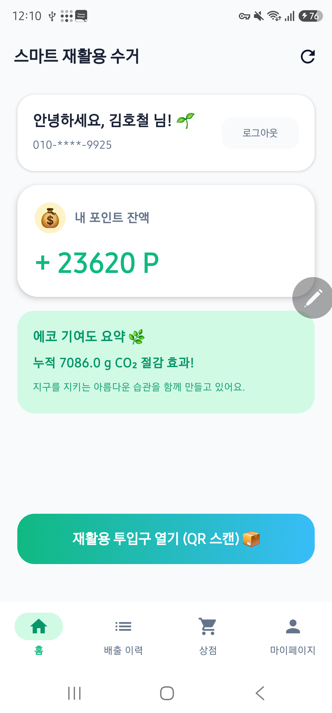
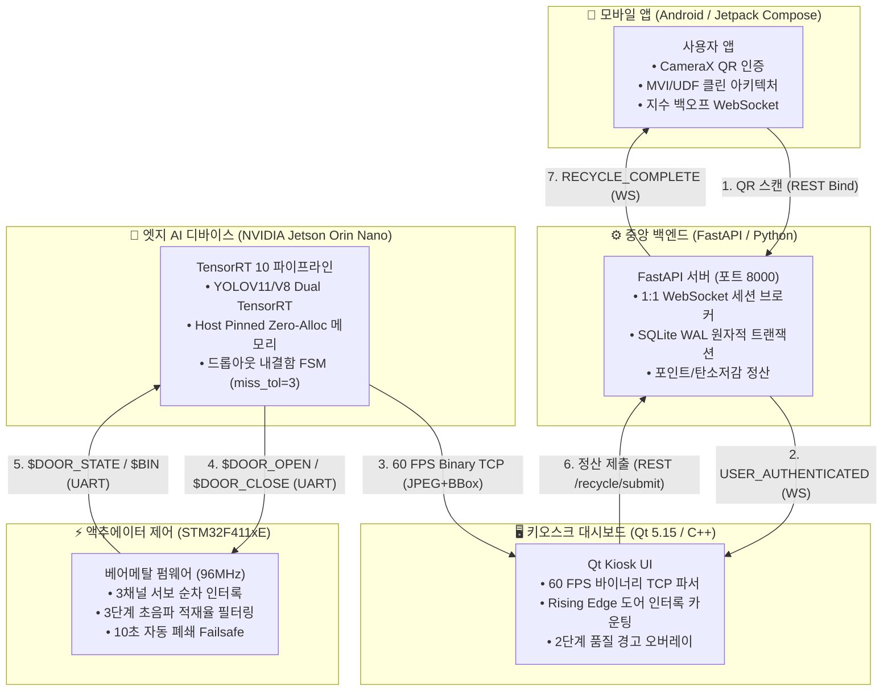

# ♻️ Smart Recycling Edge AI Kiosk

<div align="center">

[](https://www.nvidia.com/en-us/autonomous-machines/embedded-systems/jetson-orin/)
[-03234B?logo=stmicroelectronics&logoColor=white>)](https://www.st.com)
[-76B900?logo=nvidia&logoColor=white>)]()
[-41CD52?logo=qt&logoColor=white>)](https://www.qt.io)
[](https://fastapi.tiangolo.com)
[-3DDC84?logo=android&logoColor=white>)](https://developer.android.com)

**NVIDIA Jetson Orin Nano 기반 초저지연 실시간 비전 AI와 STM32 베어메탈 분류 제어가 결합된**  
**End-to-End 스마트 무인 재활용 자원 회수 에코시스템**

<br/>



<br/>

[](docs/presentation/smart_recycling_final_report.pdf)

</div>

---

## 📖 프로젝트 개요 (Overview)

**Smart Recycling Edge AI**는 재활용 쓰레기의 투입부터 AI 재질 판별, 기구 분류, 실시간 모니터링, 사용자 보상(포인트 적립)까지 전 과정을 자동화한 지능형 분리수거 키오스크 솔루션입니다.

- **비전 AI 엣지 추론**: 엣지 디바이스(NVIDIA Jetson)에서 TensorRT 10 기반 2-Stage 검사 파이프라인(객체 검출 + 크롭 영역 오염·라벨 검사)을 초당 60 FPS로 실시간 수행합니다.
- **오투입 방지 물리 인터록**: STM32F411 펌웨어가 하단 분류 모터의 도착 완료를 확인한 뒤에만 투입구를 개방하여 기계적 오분류 결함을 원천 차단합니다.
- **실시간 데이터 동기화**: 60 FPS 바이너리 TCP 스트림(Jetson ➔ Qt)과 양방향 WebSocket(Server ↔ Mobile/Kiosk)을 통해 전 단계를 밀리초 단위로 동기화합니다.
- **데이터 무결성 & 리워드**: SQLite 원자적 `RETURNING` 트랜잭션으로 포인트 이중 지급(Double Spending) 및 동시성 락 경합을 방어합니다.

### 📷 시스템 실물 및 핵심 UI 프리뷰

|                         🤖 키오스크 기구 & 초음파 센서 실물                         |                        🖥️ AI 실시간 검출 및 도어 개방 UI                         |
| :---------------------------------------------------------------------------------: | :------------------------------------------------------------------------------: |
|  |  |
|                     **4구역 수거함 & STM32 3축 서보 분류 기구**                     |                    **TensorRT 10.x 객체 검출 & 물리 인터록**                     |

|                                📱 1초 QR 바인딩                                 |                                     📱 실시간 투입 정산 푸시                                      |                        📱 탄소 절감 & 에코 리워드                         |
| :-----------------------------------------------------------------------------: | :-----------------------------------------------------------------------------------------------: | :-----------------------------------------------------------------------: |
|  |  |  |
|                          **CameraX 초고속 세션 연결**                           |                                   **WebSocket 즉시 결과 통보**                                    |                    **포인트 적립 & 소나무 식수 지표**                     |

---

## 🏗 전체 시스템 아키텍처 (End-to-End Architecture)

5대 핵심 서브시스템이 표준화된 프로토콜(UART, Binary TCP, REST API, WebSocket)로 유기적으로 연동됩니다.



---

## 🧩 서브시스템별 핵심 엔지니어링 특징 (The 5 Pillars)

| 서브시스템                       | 기술 스택                                                    | 핵심 역할 및 엔지니어링 하이라이트                                                                                                                                                                           |            세부 문서             |
| :------------------------------- | :----------------------------------------------------------- | :----------------------------------------------------------------------------------------------------------------------------------------------------------------------------------------------------------- | :------------------------------: |
| **[edge_jetson](edge_jetson)**   | Jetson Orin Nano, TensorRT 10, CUDA, OpenCV                  | • TensorRT V3 비동기 Host Pinned Zero-Alloc 파이프라인<br/>• 2-Stage Crop & Inspection (오염·라벨) 및 Fallback Graceful Bypass<br/>• 드롭아웃 프레임 보존 FSM (`miss_tolerance: 3`, `conf: 0.70`)            | [README](edge_jetson/README.md)  |
| **[mcu_firmware](mcu_firmware)** | STM32F411xE, Cortex-M4 Hard FPU, C (Bare-Metal)              | • 오투입 방지 물리 순차 인터록 (하단 2축 도착 확인 후 상단 개방)<br/>• 3단계 초음파 필터 (Drop Blanking ➔ Outlier Rejection ➔ Deadband)<br/>• 120°/s 소프트웨어 램프 구동 및 10s 자동 폐쇄 Failsafe          | [README](mcu_firmware/README.md) |
| **[pc_dashboard](pc_dashboard)** | Qt 5.15 (Qt 6 호환), C++17, QPainter, QWebSocket, QTcpSocket | • 60 FPS 바이너리 TCP 스트림 역직렬화 (Magic Byte & 메모리 재사용)<br/>• 도어 개방 Rising Edge 물리 인터록 카운팅 (영상 중복 카운트 방어)<br/>• 2단계 품질 경고 오버레이 및 키오스크 시연 모드 (`F11`/`Esc`) | [README](pc_dashboard/README.md) |
| **[server](server)**             | FastAPI, Python 3.10+, aiosqlite (WAL), Pydantic V2          | • Clean 3-Tier 계층 분리 및 논블로킹 비동기 DB I/O<br/>• SQLite 원자적 `RETURNING` 트랜잭션 (Lost Update & Double Spending 방어)<br/>• `ConnectionManager` 1:1 룸 관리 및 좀비 WebSocket 세션 퇴출           |    [README](server/README.md)    |
| **[mobile_app](mobile_app)**     | Android, Kotlin 2.x, Jetpack Compose, OkHttp, KSP            | • Clean Architecture & 단방향 데이터 흐름(MVI/UDF) 패턴<br/>• 지수 백오프(Exponential Backoff) 자동 재연결 WebSocket 클라이언트<br/>• 미인증 딥링크 보류 바인딩 UX (Hold-and-Bind Session)                   |  [README](mobile_app/README.md)  |

---

## 🚀 전체 시스템 실행 방법 (Getting Started)

전체 시스템은 **중앙 서버 ➔ MCU 펌웨어 ➔ Jetson 엣지 AI ➔ 키오스크 대시보드 ➔ 모바일 앱** 순서로 구동합니다.

```
[권장 구동 순서]
1. Server (중앙 통신망 개방) ──> 2. MCU (센서·모터 준비) ──> 3. Jetson (AI 파이프라인)
                                                                  │
4. Mobile App (QR 인증 준비) <── 5. PC Dashboard (화면 스트림 수신) ┘
```

---

### Step 1. 중앙 백엔드 서버 구동 (`server/`)

FastAPI 서버를 실행하여 REST API 엔드포인트와 WebSocket 브로커를 활성화합니다.

```bash
cd server

# 1. 가상환경 생성 및 의존성 패키지 설치
python -m venv .venv
# Windows: .venv\Scripts\activate / Linux: source .venv/bin/activate
pip install -r requirements.txt

# 2. 서버 실행 (포트 8000)
python main.py
```

> **Swagger API Docs**: 브라우저에서 `http://localhost:8000/docs` 접속을 통해 엔드포인트 동작 확인 가능.

---

### Step 2. MCU 펌웨어 플래시 (`mcu_firmware/`)

STM32F411 보드에 ST-Link를 연결하고 펌웨어를 빌드 및 다운로드합니다.

```bash
cd mcu_firmware

# 1. 펌웨어 바이너리 빌드 (ARM GCC)
make

# 2. ST-Link(SWD) 타깃 플래시 라이팅 및 리셋
make run
```

> 정상 구동 시 서보 모터 3개가 중립 각도로 정렬되고 초음파 센서 4채널이 계측을 시작합니다.

---

### Step 3. Jetson 엣지 AI 파이프라인 구동 (`edge_jetson/`)

NVIDIA Jetson Orin Nano 보드에서 카메라 캡처, TensorRT 10 추론 및 TCP/UART 브로드캐스트를 시작합니다.

```bash
cd edge_jetson

# 1. JetPack 가상환경 활성화 및 패키지 확인
source .venv/bin/activate
pip install -r requirements.txt

# 2. 메인 AI 파이프라인 실행
python3 main.py
```

- 터미널에서 **`q`** 키를 누르면 비차단 키 핸들러를 통해 카메라/시리얼/소켓 자원을 안전하게 해제(Graceful Shutdown)합니다.

---

### Step 4. PC 키오스크 대시보드 구동 (`pc_dashboard/`)

[`configs/app_config.h`](pc_dashboard/configs/app_config.h)에서 Jetson IP(`DEFAULT_JETSON_IP: 9000`)와 서버 IP(`DEFAULT_BACKEND_HOST: 8000`)를 설정한 후 빌드 및 실행합니다.

```bash
cd pc_dashboard

# 1. MSYS2 UCRT64 또는 Qt 환경에서 빌드 (Qt Creator에서는 .pro 파일 열고 바로 실행 가능)
qmake pc_dashboard.pro "CONFIG+=release"
make -j$(nproc)

# 2. 대시보드 실행
./build/release/pc_dashboard.exe
```

- **단축키 안내**:
  - `F11`: **전체화면 ↔ 창 모드 토글** (시연 및 모니터링 환경에 맞춰 분할 배치)
  - `Esc`: 창 모드로 즉시 복귀

---

### Step 5. 모바일 앱 실행 및 연동 (`mobile_app/`)

[`Constants.kt`](mobile_app/app/src/main/java/com/hocheol/smartrecyclingedgeai/utils/Constants.kt)에서 `BASE_URL = "http://<SERVER_IP>:8000/"`를 설정한 후 Android 기기에 배포합니다.

```bash
cd mobile_app

# 1. 디버그 APK 빌드 및 연결된 기기 설치 (Android Studio에서 실행하거나 CLI 사용)
./gradlew assembleDebug
./gradlew installDebug
```

- **E2E 딥링크 단독 테스트 (ADB)**:
  ```bash
  adb shell am start -a android.intent.action.VIEW -d "smartrecycle://kiosk/auth?bin_id=1"
  ```
- **모바일 기기 없는 E2E 서버 테스트 (Mock 클라이언트)**:
  ```bash
  python server/tests/mock_mobile_client.py
  ```

---

## 📂 프로젝트 디렉터리 구조 (Directory Structure)

```plaintext
smart-recycling-edge-ai/
├── edge_jetson/             # NVIDIA Jetson Orin Nano TensorRT 10 엣지 AI
│   ├── configs/             # AI 모델, 카메라, 시리얼, TCP 소켓 설정
│   ├── core/                # 2-Stage 검사기, FSM 도어 컨트롤러, TRT 엔진
│   └── stream/              # 60 FPS Binary TCP 소켓 서버 및 UART 컨트롤러
├── mcu_firmware/            # STM32F411xE 베어메탈 펌웨어
│   ├── recycle.c            # 3축 모터 순차 인터록 및 도어 FSM
│   ├── bin_filter.c         # 3단계 초음파 적재율 필터링 알고리즘
│   └── servo.c              # 120°/s 소프트웨어 각속도 램프 제어
├── pc_dashboard/            # Qt 5.15 (Qt 6 호환) / C++ 키오스크 GUI 애플리케이션
│   ├── network/             # 60 FPS Binary TCP 스트림 언패커 & WebSocket 클라이언트
│   ├── ui/                  # QPainter 렌더러, 품질 경고 오버레이, F11 풀스크린
│   └── pc_dashboard.pro     # Qt 빌드 설정 파일
├── server/                  # FastAPI 중앙 관리 및 포인트 정산 백엔드
│   ├── app/routers/         # REST API 및 WebSocket 엔드포인트
│   ├── app/services/        # 비즈니스 로직 및 1:1 WebSocket 룸 관리
│   └── app/repositories/    # SQLite WAL 원자적 SQL 트랜잭션
├── mobile_app/              # Android 모바일 클라이언트 (Jetpack Compose)
│   ├── app/src/main/        # Clean Architecture 레이어 (Data, Domain, Presentation)
│   └── build.gradle.kts     # Kotlin 2.x & Compose 빌드 명세
├── docs/                    # 종합 문서 센터 및 시연 에셋
│   ├── assets/              # 시연 GIF(demo) 및 키오스크·모바일 UI 에셋(images)
│   ├── presentation/        # 최종 프로젝트 결과보고서 (PDF)
│   ├── protocol-spec.md     # 5대 서브시스템 통합 통신 프로토콜 명세서
│   ├── troubleshooting.md   # 임베디드 & 엣지 시스템 트러블슈팅 및 신뢰성 보고서
│   ├── network-streaming.md # 60 FPS 저지연 바이너리 스트리밍 성능 최적화 보고서
│   └── README.md            # 문서 센터 메인 인덱스
└── README.md                # 메인 통합 문서 (본 파일)
```

---

## 📚 심층 기술 문서 및 보고서 (Documents & Reports)

시스템 아키텍처 및 세부 엔지니어링 구현 과정은 아래 심층 문서에서 확인할 수 있습니다.

- 📄 [**최종 프로젝트 결과보고서 (Final Presentation Report)**](docs/presentation/smart_recycling_final_report.pdf): 하드웨어 기구 설계, 8종 AI 모델 벤치마크, 2-Stage 정밀도 및 시연 평가 총괄 리포트 (PDF)
- 📡 [**통합 통신 프로토콜 명세서 (Protocol Specification)**](docs/protocol-spec.md): Jetson-Qt Binary TCP, Jetson-MCU UART, Server WebSocket 및 REST API 4개 계층 통신 규격
- 🛠️ [**임베디드 & 엣지 트러블슈팅 보고서 (Troubleshooting & Reliability)**](docs/troubleshooting.md): 서보 돌입 전류 BOR 방지, Linux DTR 리셋 방어, 초음파 센서 85% 블로킹 감축, UART ORE 하드웨어 락업 해결기
- ⚡ [**60 FPS 네트워크 스트리밍 성능 최적화 (Network Streaming Optimization)**](docs/network-streaming.md): X11 포워딩 병목 극복, 8B 바이너리 헤더 패킷화 및 프레임당 14.1ms 초저지연 달성 과정

---

## 👥 팀원 및 역할 (Team Members & Responsibilities)

| 이름       | 담당 서브시스템                      | 주요 개발 영역                                                                                                                                                                                                                                     |
| :--------- | :----------------------------------- | :------------------------------------------------------------------------------------------------------------------------------------------------------------------------------------------------------------------------------------------------- |
| **김호철** | **System Architect & Full Pipeline** | • 전 서브시스템(Jetson/Qt/Server/App/MCU) 소프트웨어 아키텍처 설계 및 통합 검증<br/>• TensorRT 10 비동기 파이프라인 및 도어 인터록 FSM 드롭아웃 유예 최적화<br/>• Qt 60 FPS 바이너리 스트리밍 및 BBox 디바운스, SQLite 원자적 포인트 트랜잭션 구현 |
| **권민지** | **Edge AI Model & Inspection**       | • Detection 모델 8종 성능 벤치마크 및 오염/라벨 검사 2-Stage 모델 최적화                                                                                                                                                                           |
| **석민정** | **MCU Control & Filtering**          | • STM32 초음파 센서 거리 계측 캘리브레이션 및 서보 모터 동작 순서 튜닝                                                                                                                                                                             |
| **현수근** | **Hardware & Mechanics**             | • 키오스크 하드웨어 기구물 설계, 서보 모터 브래킷 및 배출 통로 기구 보강                                                                                                                                                                           |

---

## 📄 라이선스 (License)

This project is licensed under the [MIT License](LICENSE).
