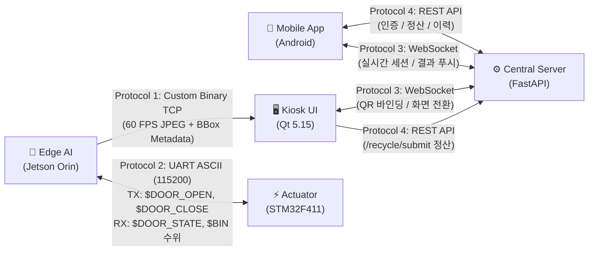
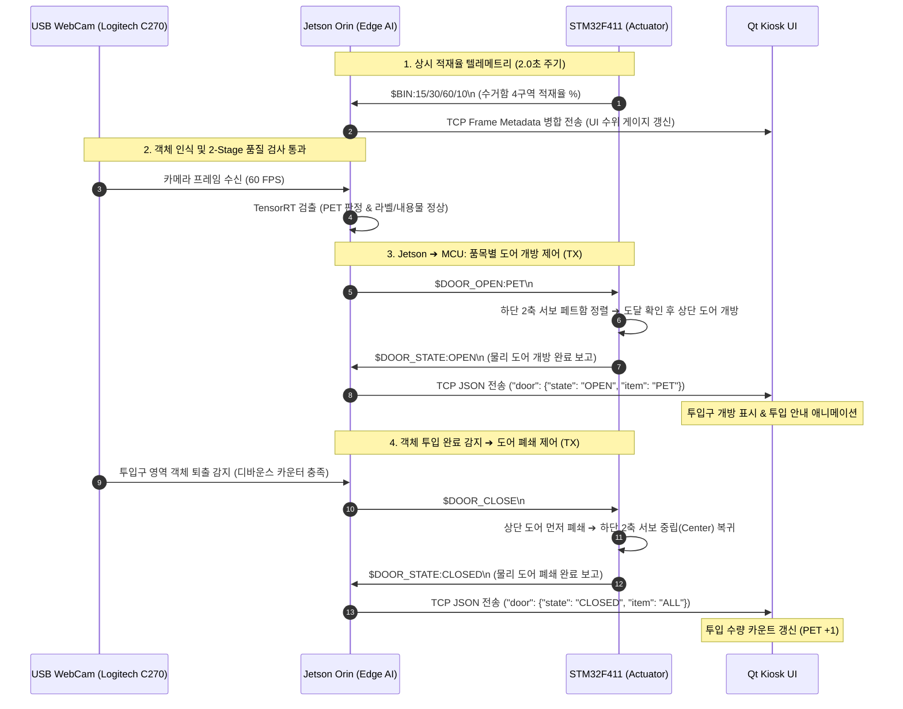
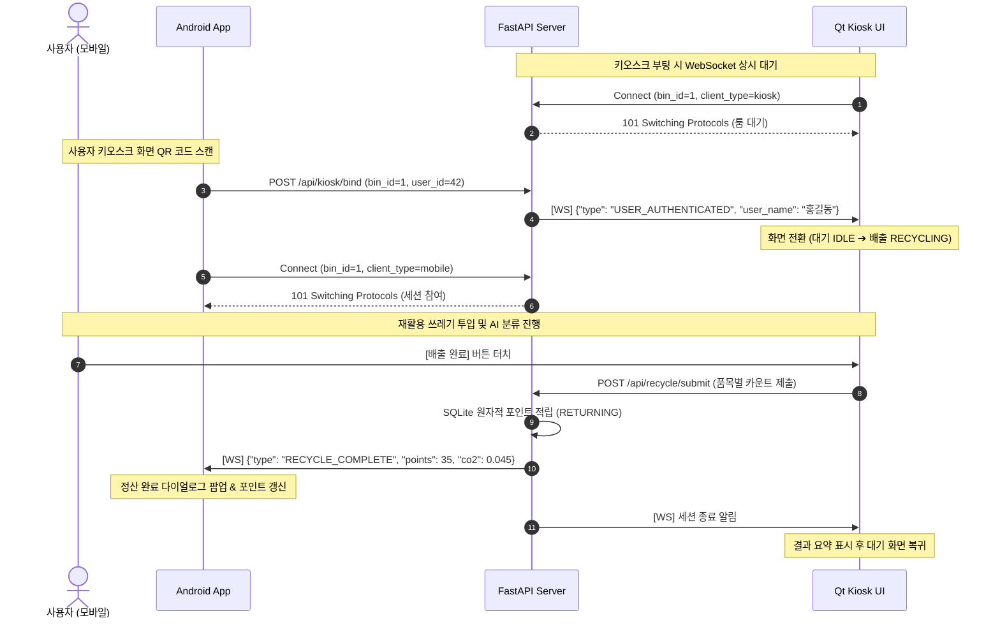

# 📡 End-to-End 시스템 통신 프로토콜 명세서 (Protocol Specification)

본 문서는 **Smart Recycling Edge AI** 시스템을 구성하는 5대 서브시스템(Jetson Orin Nano, STM32 MCU, Qt 5 Kiosk, FastAPI Server, Android Mobile App) 간의 데이터 교환 및 통신 프로토콜 규격을 정의합니다.

이종(Heterogeneous) 플랫폼 간의 결합도를 낮추고 데이터 무결성과 60 FPS 실시간성을 달성하기 위해 **바이너리 TCP 스트림, UART ASCII, REST API, WebSocket** 4개 계층의 표준 프로토콜을 설계 및 적용했습니다.

---

## 🗺️ 프로토콜 아키텍처 개요



---

## 1. Protocol 1: Jetson $\rightarrow$ Qt Kiosk (60 FPS Binary TCP Stream)

- **계층/포트**: Transport Layer / TCP (Port `9000`, `TCP_NODELAY` 활성화)
- **목적**: 엣지 디바이스의 카메라 영상(JPEG)과 TensorRT AI 검출/품질 메타데이터(JSON)를 **밀리초 단위로 완전 동기화**하여 관제 PC로 실시간 브로드캐스트.

### 1.1 패킷 프레임 레이아웃 (8-Byte Fixed Header + Dual Payload)

기존 JSON 내부 Base64 인코딩 방식(데이터 크기 33% 팽창)을 배제하고, **8바이트 고정 바이너리 헤더** 뒤에 압축 영상과 텍스트 메타데이터를 순차 배치했습니다.

```
 0                   1                   2                   3
 0 1 2 3 4 5 6 7 8 9 0 1 2 3 4 5 6 7 8 9 0 1 2 3 4 5 6 7 8 9 0 1
+-+-+-+-+-+-+-+-+-+-+-+-+-+-+-+-+-+-+-+-+-+-+-+-+-+-+-+-+-+-+-+-+
|                   Image Size (4 Bytes, uint32, Big-Endian)    |
+-+-+-+-+-+-+-+-+-+-+-+-+-+-+-+-+-+-+-+-+-+-+-+-+-+-+-+-+-+-+-+-+
|                   JSON Size  (4 Bytes, uint32, Big-Endian)    |
+-+-+-+-+-+-+-+-+-+-+-+-+-+-+-+-+-+-+-+-+-+-+-+-+-+-+-+-+-+-+-+-+
|                                                               |
|                   JPEG Image Payload (Variable Length)        |
|                   (Image Size Bytes)                          |
|                                                               |
+-+-+-+-+-+-+-+-+-+-+-+-+-+-+-+-+-+-+-+-+-+-+-+-+-+-+-+-+-+-+-+-+
|                                                               |
|                   UTF-8 JSON Metadata Payload (Variable)      |
|                   (JSON Size Bytes)                           |
|                                                               |
+-+-+-+-+-+-+-+-+-+-+-+-+-+-+-+-+-+-+-+-+-+-+-+-+-+-+-+-+-+-+-+-+
```

| 필드명            | 바이트 크기 | 데이터 타입     | 설명 및 유효 범위                                            |
| :---------------- | :---------: | :-------------- | :----------------------------------------------------------- |
| **Image Size**    |      4      | `uint32_t` (BE) | JPEG 이미지 페이로드 크기 (`1` ~ `MAX_IMAGE_SIZE: 10MB`)     |
| **JSON Size**     |      4      | `uint32_t` (BE) | 메타데이터 페이로드 크기 (`1` ~ `MAX_JSON_SIZE: 64KB`)       |
| **Image Payload** |    가변     | Raw Binary      | 인라인 하드웨어 인코딩된 JPEG 바이너리 (`Quality: 75`)       |
| **JSON Payload**  |    가변     | UTF-8 String    | AI BBox, 추론 시간, 도어 상태 등을 포함하는 표준 JSON 문자열 |

### 1.2 JSON Metadata 페이로드 명세

```json
{
  "timestamp": 1726372800.125,
  "fps": 58.4,
  "infer_ms": 10.8,
  "door": {
    "state": "OPEN",
    "item": "PET"
  },
  "bin_levels": {
    "paper": 20,
    "can": 35,
    "pet": 60,
    "vinyl": 10
  },
  "detections": [
    {
      "class_id": 2,
      "class_name": "pet",
      "category": "PET",
      "confidence": 0.94,
      "box": [120, 80, 240, 320],
      "inspection": {
        "passed": false,
        "reasons": ["LABEL_ATTACHED"],
        "details": {
          "pet_label": { "status": "FAIL", "score": 0.88 },
          "pet_content": { "status": "PASS", "score": 0.12 }
        }
      }
    }
  ]
}
```

### 1.3 클라이언트 역직렬화 및 안전장치 (Qt `jetson_client.cpp`)

- **프레임 동기화**: 수신 버퍼에 8바이트 이상 쌓였을 때만 헤더를 검사하며, 헤더 검증 실패 시 버퍼를 강제 플러시(`MAX_BUFFER_CAPACITY: 20MB`)하여 OOM을 방어합니다.
- **무복사 렌더링**: 메모리 버퍼를 재사용하여 `QPixmap::loadFromData`로 UI 스레드 끊김 없이 60 FPS 화면을 갱신합니다.

---

## 2. Protocol 2: Jetson $\leftrightarrow$ STM32 MCU (UART ASCII Stream)

- **물리 규격**: USART2 (PA2=TX, PA3=RX, 3.3V TTL), **115200 bps, 8N1**, No Flow Control
- **패킷 구분자**: 개행 문자 `\n` (`0x0A`, LF) 기준 라인 스트림.
- **설계 원칙**: 오실로스코프나 터미널 모니터에서 사람이 즉시 육안 검증할 수 있는 직관적인 ASCII 프로토콜 채택.

### 2.1 다운링크: Jetson $\rightarrow$ MCU 제어 명령 (Commands)

| 명령어 패킷             | 매개변수 규격                            | 설명 및 하드웨어 동작                                                                                                      |
| :---------------------- | :--------------------------------------- | :------------------------------------------------------------------------------------------------------------------------- |
| **`$DOOR_OPEN:<ITEM>`** | `<ITEM>`: `PET`, `CAN`, `PAPER`, `VINYL` | 하단 2축 서보를 먼저 해당 수거함으로 정렬시킨 뒤, 도착 확인(`!Servo_Is_Moving`) 후 상단 투입구 도어를 개방 (최소 2초 보장) |
| **`$DOOR_CLOSE`**       | 없음                                     | 카메라에서 물체 퇴출 감지 시 전송. 상단 도어 먼저 닫은 후 하단 모터 중립 복귀                                              |
| **`$BIN_RESET`**        | 없음                                     | 4개 수거함 초음파 필터 적재율 통계를 즉시 0%로 초기화                                                                      |
| **`<ch> <deg> [spd]`**  | `ch`(1~3), `deg`(0~180), `spd`(deg/s)    | 엔지니어링 수동 서보 테스트 명령 (예: `1 90 60`)                                                                           |

### 2.2 업링크: MCU $\rightarrow$ Jetson 텔레메트리 (Telemetry)

| 메시지 패킷                | 전송 시점                 | 데이터 필드 및 형식             | 설명                                                                 |
| :------------------------- | :------------------------ | :------------------------------ | :------------------------------------------------------------------- |
| **`$DOOR_STATE:<STATE>`**  | 상태 변경 즉시 + 1초 주기 | `<STATE>`: `OPEN` 또는 `CLOSED` | 물리 도어의 현재 개폐 상태 보고 (키오스크 카운팅 연동)               |
| **`$BIN:<P>/<C>/<T>/<V>`** | 2.0초 주기                | `0` ~ `100` (정수 백분율, %)    | 초음파 3단계 필터링(블랭킹+이상치제거+데드밴드)을 거친 실시간 적재율 |

> **내결함성 설계**: USB 연결 시 발생하는 전원 노이즈로 앞머리에 쓰레기 문자가 섞이더라도, MCU의 `strchr(line, '$')` 및 `strncmp` 안전 파서가 유효한 명령어만 정확히 추출합니다.

### 2.3 Jetson $\leftrightarrow$ MCU 양방향 제어 & 텔레메트리 시퀀스

엣지 AI의 객체 감지 및 퇴출 이벤트에 따른 **도어 개폐 명령(TX)**과 MCU의 **상태 보고 및 초음파 수위 텔레메트리(RX)** 동작 흐름입니다.



---

## 3. Protocol 3: Central Server $\leftrightarrow$ Kiosk & Mobile (WebSocket Real-time Events)

- **엔드포인트**: `ws://<HOST>:8000/ws/kiosk/{bin_id}/{client_type}`
  - `bin_id`: 키오스크 기기 고유 번호 (예: `1`)
  - `client_type`: 클라이언트 식별자 (`kiosk` 또는 `mobile`)
- **세션 룸 모델**: `ConnectionManager`가 키오스크 1대당 모바일 1대만 매핑되는 **1:1 가상 룸**을 격리 관리 (`asyncio.Lock`).



### 3.1 실시간 WebSocket 이벤트 스키마

#### 1) 사용자 인증 성공 (`USER_AUTHENTICATED` : Server $\rightarrow$ Kiosk)

```json
{
  "type": "USER_AUTHENTICATED",
  "data": {
    "user_id": 42,
    "user_name": "홍길동",
    "current_points": 1250
  }
}
```

#### 2) 정산 완료 푸시 (`RECYCLE_COMPLETE` : Server $\rightarrow$ Mobile)

```json
{
  "type": "RECYCLE_COMPLETE",
  "data": {
    "session_id": "sess_982341",
    "earned_points": 35,
    "total_points": 1285,
    "co2_reduced_kg": 0.045,
    "items": {
      "paper": 0,
      "can": 1,
      "pet": 2,
      "vinyl": 0
    }
  }
}
```

#### 3) 세션 중도 취소 (`SESSION_CANCELLED` : Server $\rightarrow$ Kiosk & Mobile)

```json
{
  "type": "SESSION_CANCELLED",
  "data": {
    "reason": "USER_CANCEL"
  }
}
```

---

## 4. Protocol 4: Central Server REST API (Transactional Endpoints)

FastAPI 백엔드는 클라이언트의 상태 변경 요청을 비동기 처리하며, SQLite WAL 엔진 및 원자적 `RETURNING` 절을 활용해 **동시성 락 경합과 포인트 이중 지급(Double Spending)**을 원천 방어합니다.

### 4.1 핵심 REST 엔드포인트 규격

| Method | Endpoint               |   요청 주체    | 목적                                           | 성공 응답                |
| :----- | :--------------------- | :------------: | :--------------------------------------------- | :----------------------- |
| `POST` | `/api/auth/login`      |     Mobile     | 휴대폰 번호 기반 원자적 UPSERT 간이 로그인     | `200 OK` (User DTO)      |
| `POST` | `/api/kiosk/bind`      |     Mobile     | 키오스크 QR 스캔 시 1:1 세션 룸 바인딩         | `200 OK` (바인딩 성공)   |
| `POST` | `/api/kiosk/cancel`    | Kiosk / Mobile | 진행 중인 배출 세션 중도 취소 및 화면 리셋     | `200 OK` (세션 초기화)   |
| `POST` | `/api/recycle/submit`  |     Kiosk      | 분리배출 집계 제출, 탄소 저감량 및 포인트 적립 | `200 OK` (정산 결과 DTO) |
| `GET`  | `/api/users/{id}/logs` |     Mobile     | 사용자별 분리배출 누적 이력 최신순 페이징      | `200 OK` (List of Logs)  |
| `POST` | `/api/users/deduct`    |     Mobile     | 상점 리워드 교환 시 조건부 원자적 포인트 차감  | `200 OK` (잔여 포인트)   |

### 4.2 배출 정산 제출 (`POST /api/recycle/submit`) 상세 명세

- **Request Body (JSON)**:

```json
{
  "bin_id": 1,
  "user_id": 42,
  "items": {
    "paper": 0,
    "can": 1,
    "pet": 2,
    "vinyl": 0
  }
}
```

- **서버 측 원자적 트랜잭션 (Race Condition 방어)**:

```sql
-- Lost Update 방어: 애플리케이션 레벨의 더하기 대신 DB 레벨 원자적 연산 수행
UPDATE users
SET points = points + 35, updated_at = CURRENT_TIMESTAMP
WHERE id = 42
RETURNING points;
```

- **Response Body (JSON, `200 OK`)**:

```json
{
  "status": "SUCCESS",
  "user_id": 42,
  "earned_points": 35,
  "total_points": 1285,
  "co2_reduced_kg": 0.045
}
```

---

## 5. 프로토콜별 에러 핸들링 및 Failsafe 규격

| 프로토콜                                 | 예외 상황                                 | Failsafe 및 복구 동작                                                                      |
| :--------------------------------------- | :---------------------------------------- | :----------------------------------------------------------------------------------------- |
| **Binary TCP (Jetson $\rightarrow$ Qt)** | 패킷 바이트 손실 또는 헤더 오염           | 버퍼 용량이 20MB를 초과하거나 불일치 시 버퍼를 즉시 플러시하고 다음 8바이트 매직 헤더 탐색 |
| **UART (Jetson $\leftrightarrow$ MCU)**  | Jetson 통신 단절로 `$DOOR_CLOSE` 누락     | MCU 자체 타이머에 의해 10초 경과 시 강제 폐쇄 (`DOOR_MAX_OPEN_MS = 10000`)                 |
| **UART (Jetson $\leftrightarrow$ MCU)**  | 초음파 센서 단선 또는 무응답              | 2ms/4ms 타임아웃으로 Super Loop 블로킹을 방지하고 `-1.0f` 에러 반환                        |
| **WebSocket (Server ↔ Clients)**         | 모바일 기기 네트워크 일시 단절            | 모바일 클라이언트가 지수 백오프(Exponential Backoff, 1s~16s) 기반 자동 재연결 수행         |
| **REST (Server)**                        | 상점 쿠폰 교환 시 동시 요청(Double Spend) | `WHERE id = ? AND points >= ?` 조건부 갱신 실패 시 즉시 `400 Bad Request` 반환             |
