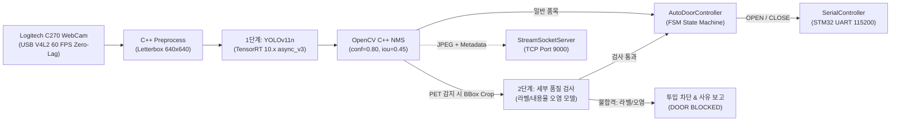

# ⚡ Smart Recycling Edge AI Vision Pipeline (Jetson)

<div align="center">

[](https://www.nvidia.com/en-us/autonomous-machines/embedded-systems/jetson-orin/)
[-green>)]()
[-blue>)]()
[]()
[-76B900?logo=nvidia&logoColor=white>)]()
[-red>)]()

**NVIDIA Jetson Orin Nano 기반 온디바이스 실시간 2-Stage 비전 AI 파이프라인 및 임베디드 FSM 도어 제어기**  
YOLOv11 TensorRT 10.x 초저지연 추론, PET 2단계 세부 품질 검사, 드롭아웃 내결함성 도어 FSM, 60 FPS 바이너리 TCP 스트리밍을 통합 제공합니다.

<br/>


<p><em>[Jetson Orin Nano 실시간 3채널 비전 AI 추론 및 초저지연 바이너리 스트리밍 시연]</em></p>

</div>

---

## 🏗️ 2-Stage 복합 비전 파이프라인 (Vision Pipeline Architecture)

단순 1차 객체 인식을 넘어, 특정 품목(PET)의 투입 적격 여부(라벨 부착/오염)를 동적으로 선별 검사하는 2단계 파이프라인 구조입니다.



---

## 📌 핵심 엔지니어링 강점 (Engineering Highlights)

### 1. Zero-Allocation Host Pinned Memory & 비동기 CUDA Stream (`trt_engine.py`)

- **GPU DMA 전송 극대화**: `cuda.pagelocked_empty`를 통해 OS 페이징을 방지하고 GPU 메모리 복사 대역폭을 최대화했습니다.
- **TensorRT 10.x V3 API**: 입출력 물리 버퍼 주소를 사전 등록(`set_tensor_address`)하여 매 프레임 발생하는 메모리 재할당 오버헤드를 제로화(Zero-Alloc)했습니다.
- **비동기 파이프라인**: `H2D 복사 ➔ 비동기 추론 ➔ D2H 복사`를 단일 CUDA Stream 상에서 넌블로킹으로 직렬화하여 CPU-GPU 병렬성을 확보했습니다.

### 2. 동적 디스패치 2-Stage 세부 검사 & 안전 바이패스 (`inspector.py`)

- **Crop & Inspect 최적화**: 1차 YOLO가 검출한 BBox 좌표를 안전 클리핑(Clamping) 후, 대상 품목(PET)에만 2단계 분류기(라벨 검사 MobileNetV3, 오염 검사 EfficientNet)를 동적 디스패치합니다.
- **Graceful Bypass (무중단 방어)**: 2단계 엔진 파일이 미배포되었거나 손상된 환경에서도 전체 키오스크 시스템이 크래시되지 않고 자동으로 안전 바이패스(BYPASS) 모드로 전환됩니다.

### 3. 드롭아웃 내결함성 도어 FSM & 손 끼임 방지 (`door_controller.py`)

- **센서 노이즈 드롭아웃 유예 (`miss_tolerance = 3`)**: 실내 조명 반사나 모션 블러로 1~2프레임 정도 일시적 신뢰도 하락(`top_item is None`)이 발생해도, 연속 감지 카운트를 즉시 리셋하지 않고 3프레임 동안 상태를 보존하여 **도어 미개방 버그를 원천 해결**했습니다.
- **신체 끼임 방지 안전 시간**: 사용자가 손을 넣는 동안 문이 닫히지 않도록 최소 개방 시간(`min_hold_sec = 3.0s`)과 부재 유예(`lost_tolerance = 30프레임`, 약 1초)를 확보했습니다.

### 4. 60 FPS 지연 없는(Zero-Lag) 카메라 & 8B 바이너리 TCP 스트리밍

- **커널 링 버퍼 지연 차단**: 로지텍 C270 웹캠의 V4L2 드라이버 버퍼를 1프레임(`CAP_PROP_BUFFERSIZE = 1`)으로 강제하고 데몬 스레드에서 최신 프레임만 폴링하여 오래된 프레임 누적(Lag)을 방지했습니다.
- **8바이트 빅엔디안 헤더**: `[JPEG Size(4B)][JSON Size(4B)] + Payload` 규격으로 관제 대시보드(Qt)에 초당 60프레임 무손실 실시간 스트리밍을 수행합니다.
- **UART 무중단 시뮬레이터**: STM32 MCU 미연결 개발 환경에서는 가상 Mock 모드로 자동 폴백되어 중단 없이 로컬 테스트가 가능합니다.

---

## 💻 엣지 런타임 사양 (Specifications)

| 항목                  | 사양 및 환경                                                    | 비고                                    |
| --------------------- | --------------------------------------------------------------- | --------------------------------------- |
| **Target Board**      | NVIDIA Jetson Orin Nano (8GB / 4GB)                             | JetPack 6.x (Ubuntu 22.04 LTS)          |
| **Inference Engine**  | NVIDIA TensorRT 10.x (`python3-libnvinfer`)                     | FP16 고속 추론 모드                     |
| **Deep Learning**     | YOLOv11n (Detection) + EfficientNet (라벨) + MobileNetV3 (오염) | 4대 재활용품(종이, 캔, 페트, 비닐) 분류 |
| **추론 파라미터**     | `conf_threshold = 0.80`, `iou_threshold = 0.45`                 | 오탐 차단 및 NMS 최적 균형값            |
| **Camera Interface**  | Logitech C270 HD WebCam (USB V4L2 `/dev/video0`)                | 640x480 @ 60 FPS (MJPG)                 |
| **Hardware I/O**      | UART (`/dev/ttyACM0`, 115200 bps)                               | STM32 ASCII 프로토콜 연동               |
| **Telemetry Network** | TCP Server (Port 9000, `TCP_NODELAY`)                           | 관제 PC 60 FPS 영상/메타데이터 전송     |

---

## 📁 디렉토리 구조 (Directory Structure)

```
edge_jetson/
├── configs/
│   └── config.py              # 불변(Frozen) 설정 (모델, 카메라, FSM 디바운스, 통신)
├── core/
│   ├── camera.py              # V4L2 60 FPS 넌블로킹 백그라운드 프레임 캡처
│   ├── trt_engine.py          # TensorRT 10 V3 비동기 Host Pinned Zero-Alloc 추론기
│   ├── detector.py            # C++ Letterbox 전처리 + TensorRT + C++ NMS
│   ├── inspector.py           # 2-Stage Crop & 세부 품질(라벨/오염) 검사 파이프라인
│   └── door_controller.py     # 드롭아웃 내결함성(miss_tolerance) 도어 제어 FSM
├── models/                    # TensorRT 직렬화 엔진 파일 (*.engine)
├── stream/
│   ├── protocol.py            # Jetson-STM32 UART 명령/응답 규격 파서
│   ├── serial_controller.py   # 스레드 안전 시리얼 송수신 및 자동 Mock 시뮬레이터
│   └── socket_server.py       # 관제 PC 연동 8B 헤더 TCP 바이너리 스트리밍 서버
├── main.py                    # 엣지 비전 AI 파이프라인 진입점 (Graceful Shutdown)
└── requirements.txt           # NumPy <2.0.0 ABI 보호 및 필수 의존성
```

---

## 🚀 빠른 시작 (Getting Started)

### 1. 환경 준비 및 의존성 설치

NVIDIA JetPack 6.x 환경에서 시스템 TensorRT 및 OpenCV CUDA 바인딩을 공유하도록 venv를 구성합니다:

```bash
# 가상환경 생성 및 활성화
python3 -m venv --system-site-packages .venv
source .venv/bin/activate

# 필수 패키지 설치
pip install -r requirements.txt
```

### 2. 하드웨어 설정 및 모델 배치

- **엔진 모델 배치**: TensorRT 직렬화 엔진(`recycle_detect_yolo11n.engine`, `pet_label_efficientnet.engine`, `pet_content_mobilenetv3.engine`)을 `models/` 디렉터리에 배치합니다.
- **STM32 시리얼 포트(/dev/ttyACM0) 영구 권한 설정**:  
  리눅스 기본 권한(`0660 root:dialout`)으로 인한 `Permission denied`를 방지하고 재부팅/재연결 시에도 권한이 유지되도록 udev 규칙을 1회 등록합니다:
  ```bash
  # ttyACM 장치 0666 자동 권한 부여 udev 규칙 등록 및 즉시 적용
  echo 'KERNEL=="ttyACM*", MODE="0666"' | sudo tee /etc/udev/rules.d/99-ttyacm.rules
  sudo udevadm control --reload-rules && sudo udevadm trigger
  sudo usermod -aG dialout $USER
  ```
- **연동 파라미터 확인** ([`configs/config.py`](configs/config.py)):
  - 카메라: `CameraConfig(device_id=0, width=640, height=480, fps=60)`
  - STM32 시리얼: `SerialConfig(port="/dev/ttyACM0", baudrate=115200)` _(MCU 미연결 시 자동 Mock 시뮬레이터로 안전 동작)_
  - TCP 스트리밍: `NetworkConfig(host="0.0.0.0", port=9000)`

### 3. 메인 파이프라인 실행

```bash
python3 main.py
```

- 실행 중 터미널에서 **`q`** 키를 누르면 비차단 키 리더가 감지하여 카메라, 시리얼, TCP 소켓, CUDA GPU 메모리를 안전하게 회수(Graceful Shutdown)하고 정상 종료합니다.
