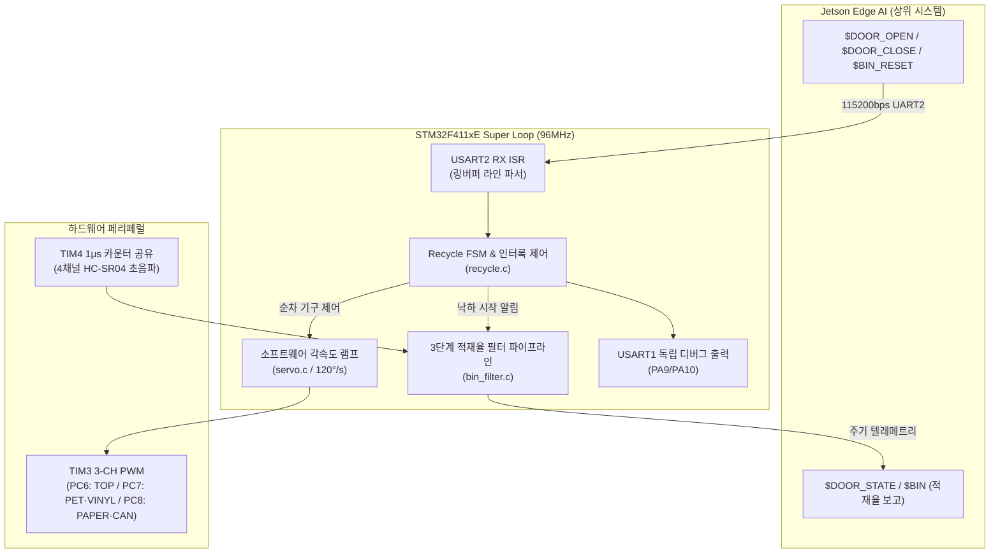

# Smart Recycling MCU Firmware

[](https://www.st.com/en/microcontrollers-microprocessors/stm32f411.html)
[](https://developer.arm.com/Processors/Cortex-M4)
[-00599C>)]()
[]()
[]()
[-lightgrey>)]()

> **ARM Cortex-M4 기반 실시간 액추에이터 제어 및 3단계 센서 필터링 베어메탈 펌웨어**  
> Jetson AI 엣지 디바이스와 115200bps UART로 연동하여 3축 서보 모터(2단 분류 트리)를 오투입 없이 순차 구동하고, 4채널 초음파 센서의 적재율을 3단계 필터(블랭킹·이상치배제·데드밴드)로 정밀 계측합니다.

---

## 🏗 System Architecture

RTOS 오버헤드를 배제한 **논블로킹 베어메탈 슈퍼 루프(Super Loop)** 구조로 1ms SysTick과 USART2 RX 인터럽트 기반의 실시간 처리를 보장합니다. 동적 메모리 할당(`malloc`)을 전면 배제하여 힙 파편화를 원천 차단했습니다.



---

## 📷 키오스크 하드웨어 기구 및 센서 구성 (Hardware & Sensor Setup)

<div align="center">
  
  <p><em>[키오스크 4구역 분리 수거함 및 초음파 센서 계측 하드웨어 실물]</em></p>
</div>

- **4구역 독립 적재함 (PET / CAN / PAPER / VINYL)**: 각 수거함 상단에 초음파 센서(HC-SR04) 4채널이 독립 배치되어 실시간 수위를 계측합니다.
- **2단 3축 서보 분류 기구물 (TIM3 PWM)**:
  - **상단 (TOP)**: 투입구 개폐 플랩 (PC6)
  - **하단 좌/우 (LOWER)**: PET ↔ VINYL 분배 가이드 (PC7), PAPER ↔ CAN 분배 가이드 (PC8)
- **순차 인터록 연동**: 하단 분배 서보가 목표 각도에 완전히 안착(`Servo_Is_Moving() == false`)된 후 상단 도어를 개방하여 기계적 오분류 결함을 원천 방지합니다.

---

## ⚡ Engineering Highlights

### 1. 오투입 방지 물리 순차 인터록 (Sequential Interlock)

- **문제**: 상단 투입구와 하단 분류판이 동시 회전할 경우, 하단 가이드가 목표 각도에 도달하기 전 쓰레기가 낙하하여 오분류되는 물리적 결함 발생.
- **해결 ([recycle.c](recycle.c))**: 하단 모터 2개(PET/VINYL, PAPER/CAN)를 먼저 회전시킨 뒤, `Servo_Is_Moving()` 폴링을 통해 두 축이 **목표각에 완전히 도달한 것을 확인한 직후** 상단 TOP 도어를 개방하는 순차 인터록 FSM 구현.

### 2. 3단계 초음파 적재율 필터 파이프라인 ([bin_filter.c](bin_filter.c))

- **1단계 - 투입 블랭킹 (Drop Blanking)**: 투입 직후 2.0초간 계측을 일시 차단하여 쓰레기 낙하 잔류물 및 공중 통과로 인한 센서 왜곡 원천 배제.
- **2단계 - 이상치 배제 평균 (Outlier Rejection)**: 5-샘플 링버퍼 삽입 정렬 후 중앙값(Median) 기준 $\pm 5\text{cm}$ 초과 이상치를 제외한 산술 평균 산출.
- **3단계 - 히스테리시스 데드밴드 (Deadband)**: 변화량이 5% 이상 누적될 때만 적재율을 갱신하여 센서 미세 지터에 의한 플리커링 제거.
- **연산 최적화**: Cortex-M4 단정밀도 하드웨어 FPU(`-mfpu=fpv4-sp-d16 -mfloat-abi=hard`)를 활용해 모든 필터링 연산을 단일 사이클로 고속 처리.

### 3. 소프트웨어 각속도 램프 & 돌입 전류 제어 ([servo.c](servo.c))

- 기성 RC 서보의 급격한 스텝 이동 시 발생하는 기구부 파손 및 피크 돌입 전류(Inrush Current)를 방지하기 위해 **120 deg/s 소프트웨어 램프 구동** 알고리즘 적용.

### 4. 이중 Failsafe 및 통신/디버그 분리 ([main.c](main.c), [isr.c](isr.c))

- **자동 폐쇄 Failsafe**: Jetson 통신 단절이나 오탐으로 `$DOOR_CLOSE`가 누락되더라도 10초 경과 시 강제 폐쇄(`DOOR_MAX_OPEN_MS = 10000`). 반대로 조기 닫힘 방지를 위한 2초 최소 개방(`DOOR_MIN_OPEN_MS = 2000`) 보장.
- **초음파 센서 무한 루프 방지**: Echo 신호 미수신 시 10ms 타임아웃으로 Super Loop 락업(Lock-up) 방지.
- **채널 격리**: Jetson 제어 프로토콜(USART2)과 디버그 로그(USART1, `Dbg_Log`)를 물리적으로 분리하여 제어 패킷 오염 방지.

---

## 🔌 핀아웃 및 페리페럴 사양

| 페리페럴     | 핀 번호                          | 설정 / 기능                                   | 비고                                       |
| :----------- | :------------------------------- | :-------------------------------------------- | :----------------------------------------- |
| **TIM3 CH1** | `PC6`                            | 50Hz PWM (0.5~2.5ms), TOP 투입구 도어         | 30°(종이·캔) / 90°(닫힘) / 150°(페트·비닐) |
| **TIM3 CH2** | `PC7`                            | 50Hz PWM (0.5~2.5ms), PET / VINYL 하단 분류판 | 130°(기본 PET) / 30°(비닐)                 |
| **TIM3 CH3** | `PC8`                            | 50Hz PWM (0.5~2.5ms), PAPER / CAN 하단 분류판 | 150°(기본 종이) / 50°(캔)                  |
| **TIM4**     | 내부                             | 1μs 단위 공용 타이머                          | 4채널 초음파 에코 펄스 폭 측정             |
| **GPIO**     | `PC0`~`PC3` / `PC4`, `PB0`~`PB2` | Trig (Out) / Echo (In) 4쌍                    | 수거함 4구역 (종이, 캔, 페트, 비닐)        |
| **USART2**   | `PA2`(TX), `PA3`(RX)             | 115200bps 8N1, RX 인터럽트 활성화             | Jetson 통신 프로토콜 전용                  |
| **USART1**   | `PA9`(TX), `PA10`(RX)            | 115200bps 8N1                                 | 펌웨어 디버그 콘솔 (`Dbg_Log`)             |

---

## 📡 UART ASCII 프로토콜 규격

| 구분                              | 메시지 포맷                  | 설명                                                |
| :-------------------------------- | :--------------------------- | :-------------------------------------------------- |
| **RX (Jetson $\rightarrow$ MCU)** | `$DOOR_OPEN:<TYPE>`          | `PAPER`, `CAN`, `PET`, `VINYL` 분류 경로 개방       |
|                                   | `$DOOR_CLOSE`                | 물체 투입 완료 감지 시 복귀 (최소 2초 유지 후 반영) |
|                                   | `$BIN_RESET`                 | 4개 수거함 적재율 필터 및 통계 0% 초기화            |
|                                   | `<servo> <angle> [spd]`      | 엔지니어링 서보 수동 테스트 (예: `1 90 60`)         |
| **TX (MCU $\rightarrow$ Jetson)** | `$DOOR_STATE:<OPEN\|CLOSED>` | 도어 개폐 상태 변경 시 즉시 전송                    |
|                                   | `$BIN:<P>/<C>/<T>/<V>`       | 4채널 필터링 적재율(%) 2초 주기 전송                |

---

## 🛠️ 빌드, 플래시 및 테스트 (Build & Flash)

### 1. ARM GNU 툴체인 경로 설정

[`Makefile`](Makefile)의 `TOOL_DIR` 변수를 설치된 ARM GCC 경로로 지정합니다:

```makefile
TOOL_DIR = C:\arm-gnu-toolchain-15.2.rel1-mingw-w64-i686-arm-none-eabi
```

### 2. 빌드 및 ST-Link 플래시

```bash
# 1. 펌웨어 빌드 (ELF 및 순수 바이너리 rom_0x08000000.bin 생성)
make

# 2. ST-Link(SWD)를 통한 타깃 플래시 라이팅 및 자동 리셋
make run

# 3. 빌드 산출물 초기화
make clean
```

### 3. 시리얼 터미널 수동 제어 테스트

USART2(PA2/PA3, 115200bps) 연결 후 PC 시리얼 모니터에서 명령을 전송하여 하드웨어를 직접 점검할 수 있습니다:

- `$DOOR_OPEN:PET`: PET 분류 시퀀스 구동 (하단 모터 도착 후 상단 개방)
- `$DOOR_CLOSE`: 투입 완료 닫힘 요청 (최소 2초 보장 후 닫힘)
- `1 90 60`: 1번 서보(TOP) 90도 위치로 60°/s 속도 램프 이동
- `reset`: 4개 수거함 초음파 필터 적재율 0% 수동 초기화
