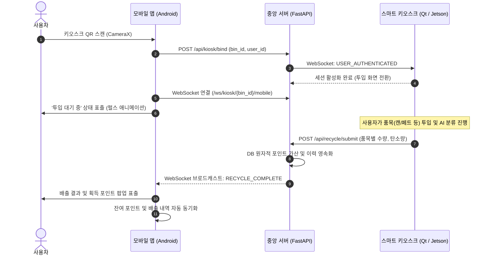

# 📱 Smart Recycling Mobile App (Android)

<div align="center">

[](https://developer.android.com)
[](https://kotlinlang.org)
[-4285F4?logo=jetpackcompose&logoColor=white>)](https://developer.android.com/jetpack/compose)
[]()
[-success>)]()
[]()

**스마트 키오스크(Qt/Jetson)와 실시간 연동되는 친환경 리워드 모바일 애플리케이션**  
CameraX 기반 1초 QR 바인딩, OkHttp WebSocket 실시간 배출 정산 피드백, 에코 게이미피케이션 및 리워드 샵을 제공합니다.

</div>

---

## 📌 핵심 기능 (Key Features)

| 기능                        | 기술 구현                   | 사용자 경험 (UX)                                                                    |
| --------------------------- | --------------------------- | ----------------------------------------------------------------------------------- |
| **초고속 QR & 딥링크 연동** | `CameraX` + `Google ML Kit` | 키오스크 화면의 QR 코드를 1초 만에 스캔하여 즉시 1:1 사용자 세션 바인딩             |
| **실시간 배출 정산 수신**   | `OkHttp WebSocket`          | 키오스크 투입 완료 시 품목별 수량, 탄소 저감량, 적립 포인트를 팝업으로 즉각 수신    |
| **에코 게이미피케이션**     | Domain Engine               | 누적 배출량 기반 3단계 등급제(🌱새싹 ➔ 🌿나무 ➔ 🌳숲) 및 소나무 식수 환산 지표 제공 |
| **포인트 리워드 샵**        | `Retrofit2` + `DataStore`   | 적립된 포인트로 기프티콘, 종량제 봉투 교환 (서버 원자적 포인트 차감 연동)           |

---

## 🏗 시스템 상호작용 흐름 (Interaction Flow)

사용자가 키오스크 QR을 스캔하고 재활용품을 투입한 뒤 실시간으로 포인트를 정산받는 단일 파이프라인입니다.



---

## 💡 엔지니어링 및 아키텍처 강점 (Engineering Highlights)

### 1. 계층형 클린 아키텍처 & MVI 단방향 데이터 흐름 (UDF)

- **철저한 계층 분리**: `presentation` (Compose UI, ViewModel) ➔ `domain` (Entity, Business Rule) ➔ `data` (Repository, DataSource, DTO)의 3계층 의존성 규칙을 준수하여 모듈 결합도를 최소화했습니다.
- **불필요한 리컴포지션 0% 방어**: UI State 및 도메인 모델에 `@Immutable` 및 `@Stable`을 적용하고, 인라인 람다 대신 메서드 참조(Method Reference)를 사용하여 렌더링 성능을 극대화했습니다.

### 2. WebSocket 복원력 및 수명주기 누수 방지 (`KioskWebSocketManager`)

- **지수 백오프(Exponential Backoff)**: 네트워크 순단 시 `1s -> 2s -> 4s` 지수 대기 후 자동 재연결 파이프라인을 가동합니다.
- **상태와 이벤트의 명확한 분리**: 연결 상태는 `StateFlow<WebSocketConnectionState>`로, 정산/취소 같은 단발성 이벤트는 `SharedFlow`로 격리하여 화면 회전 시 이벤트 중복 소비를 방지했습니다.
- **메모리/소켓 누수 차단**: 세션 정상 종료 시 표준 `1000 NORMAL_CLOSURE` 코드로 소켓을 닫고, `SupervisorJob` 기반 코루틴 스코프를 안전하게 캔슬합니다.

### 3. 미인증 상태 딥링크 진입 엣지 케이스 처리

- 로그아웃 상태에서 외부 딥링크(`smartrecycle://kiosk/auth?bin_id=1`)로 진입할 경우, 세션이 끊기지 않도록 `pendingDeeplinkBinId`에 타깃 키오스크를 보류해 둔 뒤 **로그인 완료 즉시 바인딩을 자동으로 연계**하는 연속적인 사용자 경험(UX)을 구현했습니다.

### 4. 고성능 비동기 툴체인 (KSP & Kotlin 2.x)

- 무거운 구형 `kapt` 대신 **KSP(Kotlin Symbol Processing)**를 전면 도입하여 Dagger Hilt 및 Moshi 어댑터 코드 생성 속도를 최적화했습니다.

---

## 🛠 기술 스택 (Tech Stack)

| 영역                  | 기술 스택                                                              |
| --------------------- | ---------------------------------------------------------------------- |
| **UI & Presentation** | Jetpack Compose (BOM 2026.08), Material 3, Lifecycle ViewModel Compose |
| **비동기 & 동시성**   | Kotlin Coroutines, StateFlow, SharedFlow                               |
| **의존성 주입 (DI)**  | Dagger Hilt 2.60 (KSP 기반)                                            |
| **네트워크 & 직렬화** | Retrofit 3.0, OkHttp 5.5 (HTTP/WebSocket), Moshi Kotlin (CodeGen)      |
| **로컬 영속화**       | Jetpack DataStore Preferences (세션 및 포인트 캐싱)                    |
| **온디바이스 비전**   | CameraX 1.6, Google ML Kit Barcode Scanning                            |

---

## 📁 디렉토리 구조 (Directory Structure)

```
mobile_app/app/src/main/java/com/hocheol/smartrecyclingedgeai/
├── data/
│   ├── local/          # DataStore 기반 SessionManager (토큰, 포인트 영속화)
│   ├── model/          # Moshi Request/Response DTO
│   ├── remote/         # Retrofit API 인터페이스 및 KioskWebSocketManager
│   └── repository/     # AuthRepository, KioskRepository 구현체
├── di/                 # Hilt 의존성 주입 모듈 (Network, Repository, Storage)
├── domain/model/       # UI와 격리된 순수 비즈니스 엔티티 (User, RecycleResult 등)
├── presentation/       # 단일 액티비티 기반 화면 계층
│   ├── home/           # 메인 홈, CameraX QR 스캐너, 정산 결과 다이얼로그
│   ├── history/        # 분리배출 이력 및 누적 탄소 저감량 요약
│   ├── shop/           # 포인트 리워드 교환 상점 (원자적 차감)
│   └── mypage/         # 사용자 등급, 소나무 식수 효과, 분리배출 가이드
└── utils/              # 네트워크 전역 상수(Constants), 포맷터
```

---

## 🚀 빠른 시작 (Getting Started)

### 1. 서버 접속 IP 설정

[`Constants.kt`](app/src/main/java/com/hocheol/smartrecyclingedgeai/utils/Constants.kt)에서 중앙 FastAPI 서버 주소를 설정합니다.

```kotlin
object Constants {
    const val BASE_URL = "http://<SERVER_IP>:8000/"
    const val WS_BASE_URL = "ws://<SERVER_IP>:8000/"
}
```

### 2. 빌드 및 기기 설치 (CLI / Android Studio)

- **Android Studio 사용 시**: `mobile_app` 폴더를 프로젝트로 열고 Gradle Sync 완료 후 **Run 'app' (`Shift + F10`)** 실행.
- **CLI 터미널 사용 시** (JDK 17+ 필요):

```bash
# 1. 디버그 APK 빌드 (Windows: gradlew.bat, macOS/Linux: ./gradlew)
./gradlew assembleDebug

# 2. 연결된 Android 기기(USB 디버깅) 또는 에뮬레이터에 즉시 설치
./gradlew installDebug

# 3. ADB를 통한 딥링크 단독 테스트 (키오스크 화면 없이 인증/바인딩 동작 확인)
adb shell am start -a android.intent.action.VIEW -d "smartrecycle://kiosk/auth?bin_id=1"
```

> **빌드 산출물**: `app/build/outputs/apk/debug/app-debug.apk`
