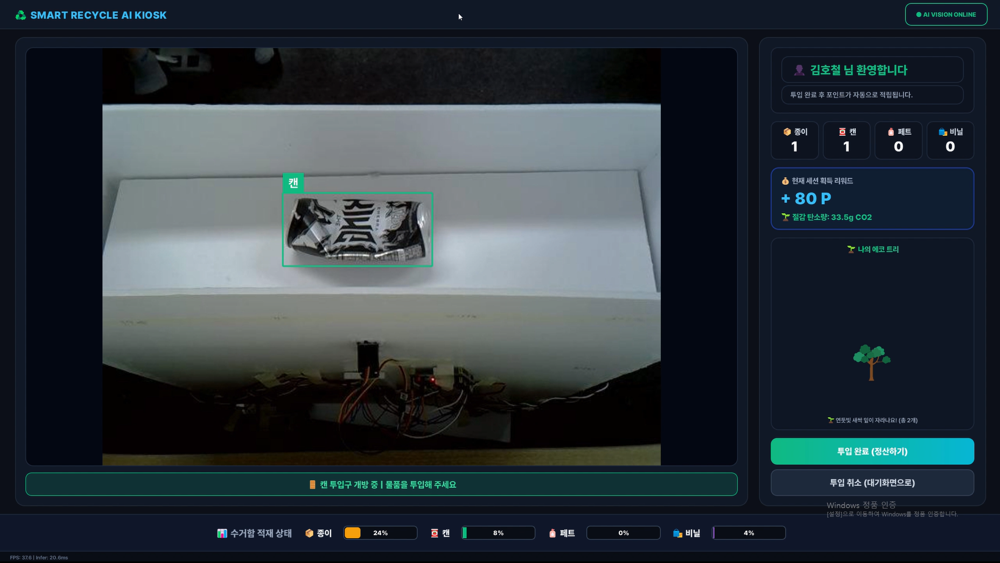
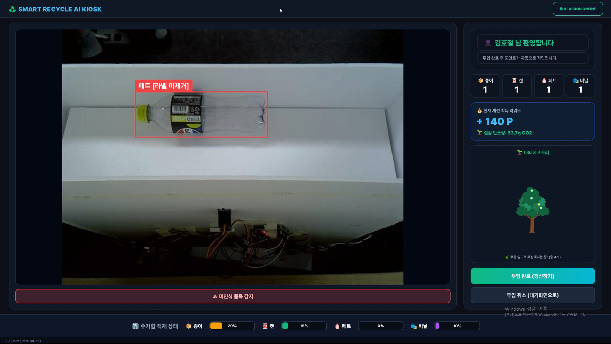
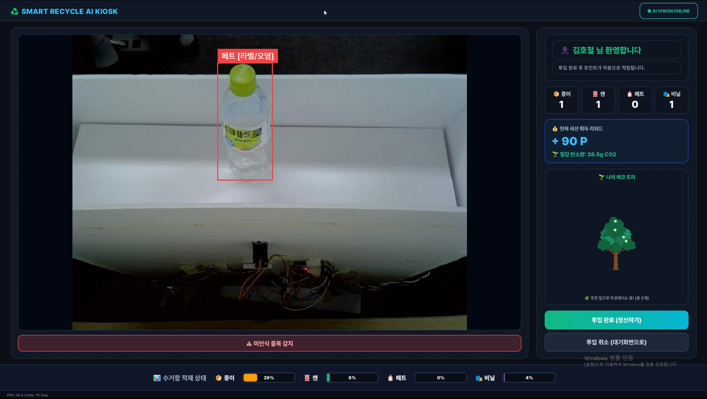
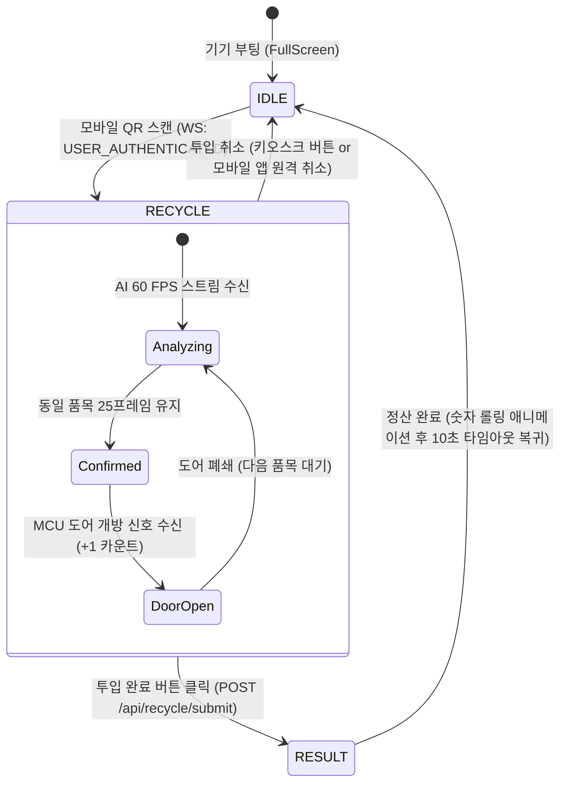

# 🖥️ Smart Recycling Kiosk Dashboard (Qt / C++)

<div align="center">

[](https://isocpp.org)
[](https://www.qt.io)
[]()
[-red>)]()
[]()
[]()

**NVIDIA Jetson 엣지 AI와 연동되어 60 FPS 고속 비전 스트림 및 BBox를 렌더링하고, 중앙 서버와 실시간 세션을 동기화하는 C++/Qt 키오스크 대시보드**

</div>

---

## 📌 핵심 엔지니어링 강점 (Engineering Highlights)

### 1. 60 FPS 저지연 바이너리 TCP 패킷 언패커 (`JetsonClient`)

- **8바이트 빅엔디안 바이너리 프로토콜**: `[JPEG Size(4B)][JSON Size(4B)] + Payload` 규격을 자체 파싱하여 네트워크 대역폭 및 역직렬화 오버헤드를 극소화했습니다.
- **버퍼 오버플로우 방어**: 패킷 손상 시 메모리 누적을 방지하는 20MB 상한 강제 플러시 및 링 버퍼 기반 메모리 재할당 최소화 설계로 프레임 드롭 없는 60 FPS 모니터링을 실현했습니다.

### 2. 하드웨어 물리 인터록 카운팅 (Anti-Fraud Interlock)

- **오인식 및 부정 투입 원천 차단**: 카메라가 물체를 감지했다고 바로 카운트하지 않고, **MCU의 물리적 서보 도어 개방(Rising Edge) 센서 신호**가 수신되는 순간에만 수량(+1)과 포인트를 확정합니다.
- **도어 개방 중 중복 카운트 방지**: 도어가 열려있는 동안에는 AI 인식을 일시 홀드하여 투입 진행 중인 단일 물체의 중복 가산을 방지합니다.

### 3. 2-Stage 세부 품질 검사(라벨/오염) 시각화 피드백

- YOLO 1차 분류 외에, 엣지 AI의 2단계 세부 검사 결과(`pet_label`, `pet_content`)를 수신하여 라벨 미제거 또는 이물질 오염 감지 시 **즉시 적색 경고 BBox와 투입 차단 가이드 배너**를 오버레이합니다.

|                                 ✅ 정상 통과 (Pass & Open)                                  |                              ⚠️ 1차 경고: 라벨 미제거 (Label Warning)                              |                            🚫 2차 경고: 복합 오염 감지 (Stain Warning)                             |
| :-----------------------------------------------------------------------------------------: | :------------------------------------------------------------------------------------------------: | :------------------------------------------------------------------------------------------------: |
|        |  |  |
| • 객체 인식 및 분류 안정화<br/>• 녹색 BBox & 투입구 개방 안내<br/>• MCU 도어 서보 즉각 구동 |    • 비닐 라벨 미제거 검출<br/>• 황색 경고 배너 오버레이<br/>• "라벨을 떼고 넣어주세요" 가이드     |   • 잔여 음료 및 내부 오염 검출<br/>• 적색 경고 배너 오버레이<br/>• "내용물을 비우고 헹궈주세요"   |

### 4. 시각적 플리커링(Flickering) 방지 및 디바운스 최적화

- **BBox 홀드 유예 (`m_missCount`)**: 순간적인 조명 반사나 모션 블러로 1~2프레임 미검출 시 직전 박스를 부드럽게 유지하여 화면 깜빡임을 100% 제거했습니다.
- **안정 인식 디바운스 동기화**: `STABLE_FRAME_THRESHOLD = 25`(약 0.8초) 연속 인식 시에만 확정 상태 배너로 전환하여 Jetson FSM 도어 개방과 완벽히 동기화됩니다.

---

## 🔄 3단계 상태머신 화면 흐름 (Kiosk Screen Flow)



| 화면 (Page)                   | 구현 특징                   | 사용자 경험 (UX)                                                           |
| ----------------------------- | --------------------------- | -------------------------------------------------------------------------- |
| **대기 화면 (`IdlePage`)**    | `qrcodegen` (C++ 내장 엔진) | 딥링크(`smartrecycle://...`) QR 코드를 메모리에서 즉시 동적 벡터 렌더링    |
| **배출 화면 (`RecyclePage`)** | `QPainter` 커스텀 오버레이  | 60 FPS 비전 영상, BBox, 안내 배너 및 누적 에코 트리 단계별 성장 애니메이션 |
| **결과 화면 (`ResultPage`)**  | `QTimer` 이징 애니메이션    | 획득 포인트 및 탄소 저감량 숫자 롤링 연출, 축하 효과 및 10초 자동 복귀     |

---

## 🌐 시스템 네트워크 연동 사양

| 대상 시스템          | 프로토콜   | 엔드포인트 (기본값)                                    | 역할                                                |
| -------------------- | ---------- | ------------------------------------------------------ | --------------------------------------------------- |
| **Jetson Orin Nano** | Binary TCP | `10.10.15.48:9000`                                     | 60 FPS JPEG 영상 프레임 + BBox 추론 메타데이터 수신 |
| **FastAPI Backend**  | WebSocket  | `ws://10.10.15.8:8000/ws/kiosk/{bin_id}/kiosk`         | QR 로그인 세션 개시 및 양방향 세션 취소 동기화      |
| **FastAPI Backend**  | HTTP REST  | `POST /api/recycle/submit`<br>`POST /api/kiosk/cancel` | 최종 배출 품목/포인트 영속화 및 취소 처리           |

---

## 📁 디렉터리 구조 (Directory Structure)

```
pc_dashboard/
├── configs/         # 전역 설정(app_config.h), UI 컬러 토큰(theme_constants.h)
├── controllers/     # 세션 제어기(recycle_session_controller), 에코 트리(eco_tree_controller)
├── network/         # Jetson TCP 클라이언트(jetson_client), 서버 WS/REST 클라이언트(server_client)
├── ui/              # MainWindow 및 3대 화면(idle_page, recycle_page, result_page)
├── utils/           # 내장 C++ QR 생성 라이브러리(qrcodegen.hpp/.cpp)
├── resources/       # GIF 애니메이션 및 아이콘 리소스 (.qrc 번들링)
├── pc_dashboard.pro # Qt qmake 빌드 설정 (C++17, MinGW -O3 최적화)
└── main.cpp         # 키오스크 전체화면 모드 진입점
```

---

## 🚀 빌드 및 실행 가이드 (Build & Run)

### 1. 네트워크 접속 IP/Port 설정

[`configs/app_config.h`](configs/app_config.h)에서 연동할 Jetson 보드 및 중앙 서버의 주소를 설정합니다:

```cpp
namespace Config {
    constexpr char DEFAULT_JETSON_IP[]    = "10.10.15.48"; // Jetson TCP IP (로컬: "127.0.0.1")
    constexpr quint16 JETSON_PORT         = 9000;          // Jetson 60 FPS Binary TCP 포트
    constexpr char DEFAULT_BACKEND_HOST[] = "10.10.15.8";  // FastAPI 서버 IP (로컬: "127.0.0.1")
    constexpr quint16 DEFAULT_BACKEND_PORT= 8000;          // FastAPI REST/WS 포트
}
```

### 2. 빌드 및 실행 (Qt Creator / MSYS2 CLI)

- **Qt Creator 사용 시**: `pc_dashboard.pro` 파일을 열고 Kit(MinGW 또는 MSVC) 선택 후 **Build & Run (`Ctrl + R`)** 실행.
- **MSYS2 UCRT64 CLI 사용 시**:

```bash
# 1. 의존성 툴체인 및 패키지 설치
pacman -S --needed mingw-w64-ucrt-x86_64-gcc mingw-w64-ucrt-x86_64-make mingw-w64-ucrt-x86_64-qt5-base mingw-w64-ucrt-x86_64-qt5-websockets

# 2. qmake 설정 및 병렬 빌드
qmake pc_dashboard.pro "CONFIG+=release"
make -j$(nproc)

# 3. 키오스크 대시보드 실행
./build/release/pc_dashboard.exe
```

### 3. 키오스크 시연 및 발표 단축키 (Demo Controls)

- **`F11`**: **전체화면(FullScreen) ↔ 창 모드(Windowed) 토글**  
  (시연 중 발표 슬라이드나 Jetson 터미널 창과 화면을 나란히 분할 배치할 때 유용)
- **`Esc`**: 전체화면 상태에서 즉시 창 모드로 안전 복귀
